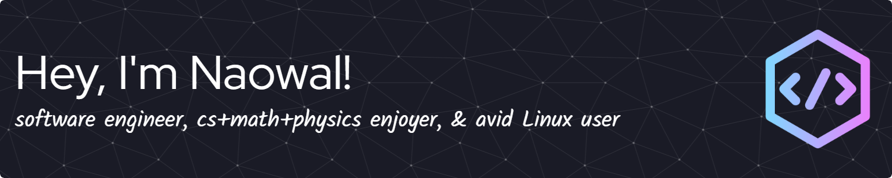

<!-- ### Hi there, I'm Naowal!  -->


```javascript
const naowal = {
    code: [Python, C++, C, TypeScript, JavaScript, HTML, CSS, Lua, Java, Shell, Julia],
    tools: [PyTorch, NumPy, Pandas, ROS, NextJS, React, Firebase, Supabase, Neovim],
    os: Arch Linux,
    interests: [Robotics, Machine Learning, Systems, Linux, Computation, Competitive Programming],
    fun: [Lifting, No Man's Sky, Minecraft]
}
```


